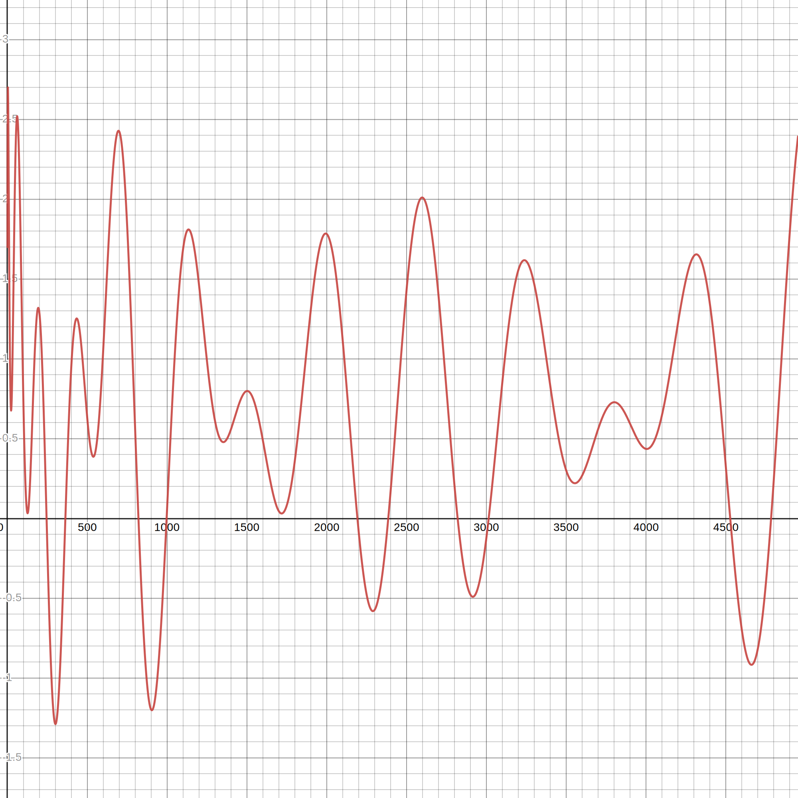

# SLO

You'll find some proof of concepts, research documents, es queries...

## Generate SLO historical data and continous data

Handy if you want to generate some data for an existing SLO, and keep generating the data as time passes.
The script will generate 3 month of historical data, and then every minute, will insert a new document.

1. Create an SLO through the API. Copy the slo `id`
2. Stop the **transform** manually associated to this slo
3. Remove the data manually (delete by query or delete all slo indices)
4. Run `node lib/continuous_rollup_data_generator/index.js slo_id` 


The data is generated with the following noise function. When the function returns a negative value, we use it to compute the `good` events as a ratio of the `total` events.



## Generate latency logs

Generates some latency logs that can be used for creating SLOs on. The logs contains `latency` field.

`SCENARIO` can be either:
- `90percent_good`: 90% of the time, the latency is below 100ms ([0, 100]), or above 300ms ([300, 600])
- `95percent_good`: 95% of the time, the latency is below 100ms ([0, 100]), or above 300ms ([300, 600])
- `99percent_good`: 99% of the time, the latency is below 100ms ([0, 100]), or above 300ms ([300, 600])
- `full_outage_every_day`: Follow a sinusoidale function to generate the good (f(x) >= 0) and bad (f(x) < 0) logs. Function is meant to be negative once per day-ish
- `healthy_then_failing`: Previous data is 100% good, then starts failing


```bash
	SCENARIO="95percent_good" node lib/latency_logs_generator/index
```

## Generate historical summary data

Generates some historical summary data to be use in tests/storybook. Tweak the scripts under `lib/historical_summary_generator` to match the expected use case then run:
```bash
  node lib/historical_summary_generator/index
```